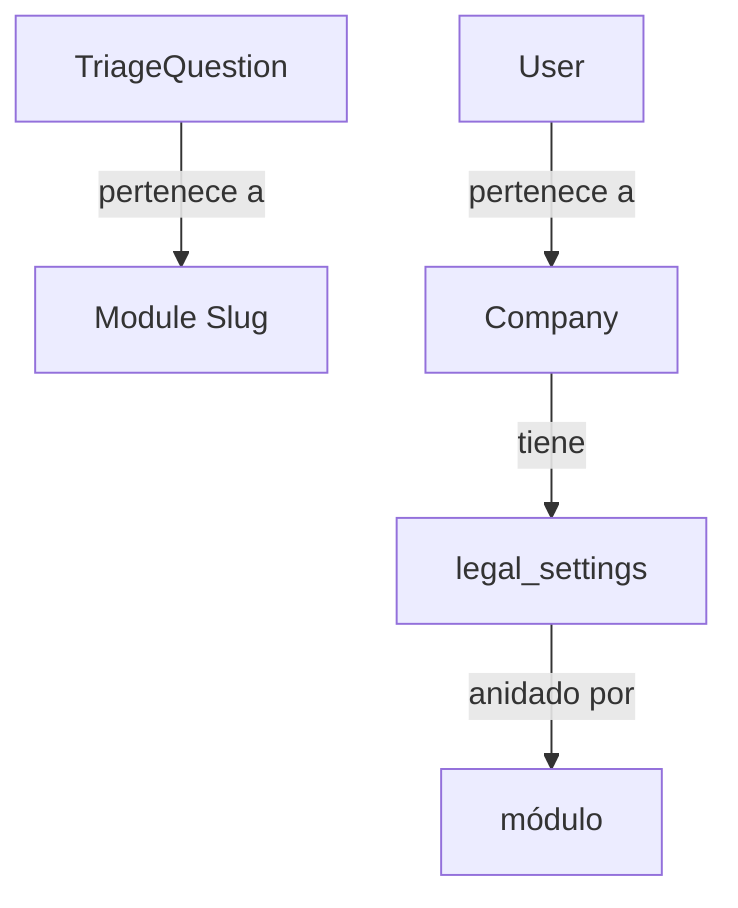

# Plan de Implementación: Sistema de Triage Dinámico y Multi-Módulo

## Arquitectura Corregida



## 1. Migración y Modelo TriageQuestion

### Migración: `create_triage_questions_table.php`

```php
Schema::create('triage_questions', function (Blueprint $table) {
    $table->id();
    $table->string('module_slug'); // ej: 'policies', 'arco', 'breaches'
    $table->string('key'); // ej: 'has_employees', 'has_digital_presence'
    $table->string('label'); // Texto de la pregunta
    $table->text('description')->nullable(); // Descripción opcional
    $table->enum('type', ['boolean', 'select', 'multiselect', 'text', 'number']);
    $table->json('options')->nullable(); // Para select/multiselect
    $table->json('required_condition')->nullable(); // Condición para mostrar
    $table->integer('order')->default(0);
    $table->boolean('is_active')->default(true);
    $table->timestamps();

    $table->unique(['module_slug', 'key']);
    $table->index('module_slug');
});
```

### Modelo: `TriageQuestion.php`

```php
class TriageQuestion extends Model
{
    protected $fillable = [
        'module_slug',
        'key',
        'label',
        'description',
        'type',
        'options',
        'required_condition',
        'order',
        'is_active',
    ];

    protected $casts = [
        'options' => 'array',
        'required_condition' => 'array',
        'is_active' => 'boolean',
    ];
}
```

## 2. Modificar LegalTemplate - Agregar required_condition

### Cambios en `LegalTemplate.php`

```php
// Agregar al $fillable
protected $fillable = [
    'document_type',
    'name',
    'version',
    'content',
    'wizard_schema',
    'is_active',
    'required_condition', // NUEVO: Condición para determinar qué templates aplicar
];

// Agregar al $casts
protected $casts = [
    'is_active' => 'boolean',
    'wizard_schema' => 'array',
    'required_condition' => 'array', // NUEVO
];
```

## 3. Verificar Company con legal_settings en cast

**Estado:** ✅ Ya está implementado en `Company.php`

```php
protected $casts = [
    'legal_settings' => 'array', // Ya existe
];
```

## 4. Form Request: UpdateLegalSettingsRequest (DINÁMICO)

```php
class UpdateLegalSettingsRequest extends FormRequest
{
    public function rules(): array
    {
        return [
            'module_slug' => ['required', 'string'],
            'answers' => ['required', 'array'],
        ];
    }
}
```

## 5. Controladores y Endpoints

### TriageQuestionController

```php
class TriageQuestionController extends Controller
{
    // GET /api/triage-questions?module={module_slug}
    public function index(Request $request)
    {
        $moduleSlug = $request->query('module');
        
        $questions = TriageQuestion::where('module_slug', $moduleSlug)
            ->where('is_active', true)
            ->orderBy('order')
            ->get();

        return response()->json([
            'status' => true,
            'data' => $questions,
        ]);
    }
}
```

### CompanyController - updateLegalSettings (anidado por módulo)

```php
public function updateLegalSettings(UpdateLegalSettingsRequest $request)
{
    $company = $request->user()->company;
    
    $module = $request->validated('module_slug');
    $answers = $request->validated('answers');

    $currentSettings = $company->legal_settings ?? [];
    
    // Guardamos las respuestas DENTRO de la llave del módulo correspondiente
    $currentSettings[$module] = array_merge($currentSettings[$module] ?? [], $answers);

    $company->update([
        'legal_settings' => $currentSettings,
    ]);

    return response()->json([
        'status' => true,
        'message' => 'Triage completado. Tu ecosistema legal ha sido configurado.',
        'data' => [
            'legal_settings' => $company->legal_settings,
        ],
    ]);
}
```

## 6. Seeder de Ejemplo

```php
class TriageQuestionSeeder extends Seeder
{
    public function run(): void
    {
        $questions = [
            // Módulo: policies
            [
                'module_slug' => 'policies',
                'key' => 'has_employees',
                'label' => '¿La empresa tiene empleados?',
                'type' => 'boolean',
                'order' => 1,
            ],
            [
                'module_slug' => 'policies',
                'key' => 'has_digital_presence',
                'label' => '¿La empresa tiene presencia digital (sitio web, app)?',
                'type' => 'boolean',
                'order' => 2,
            ],
            [
                'module_slug' => 'policies',
                'key' => 'employee_count',
                'label' => 'Número de empleados',
                'type' => 'number',
                'required_condition' => [
                    'key' => 'has_employees',
                    'value' => true,
                ],
                'order' => 3,
            ],
            // Módulo: arco
            [
                'module_slug' => 'arco',
                'key' => 'has_arco_portal',
                'label' => '¿La empresa tiene portal de solicitudes ARCO?',
                'type' => 'boolean',
                'order' => 1,
            ],
        ];

        foreach ($questions as $question) {
            TriageQuestion::create($question);
        }
    }
}
```

## 7. Policy para TriageQuestion

```php
class TriageQuestionPolicy
{
    public function viewAny(User $user): bool
    {
        return $user->hasRole('company_admin');
    }
}
```

## 8. Rutas API

```php
// routes/api.php
Route::middleware('auth:sanctum')->group(function () {
    Route::middleware('role:company_admin')->prefix('company')->group(function () {
        // Triage Questions - filtrado por módulo
        Route::get('triage-questions', [TriageQuestionController::class, 'index']);
        
        // Legal Settings - anidado por módulo
        Route::patch('legal-settings', [CompanyController::class, 'updateLegalSettings']);
        
        // Legal Templates
        Route::get('legal-templates', [LegalTemplateController::class, 'index']);
    });
});
```

## Estructura de legal_settings (anidada por módulo)

```json
{
  "policies": {
    "has_employees": true,
    "has_digital_presence": true,
    "employee_count": 15
  },
  "arco": {
    "has_arco_portal": true
  },
  "breaches": {
    "has_incident_response": false
  }
}
```

## Resumen de Archivos a Crear/Modificar

| Archivo | Acción |
|---------|--------|
| `database/migrations/xxxx_create_triage_questions_table.php` | Crear |
| `app/Models/TriageQuestion.php` | Crear |
| `app/Models/LegalTemplate.php` | Modificar |
| `app/Http/Controllers/TriageQuestionController.php` | Crear |
| `app/Http/Controllers/CompanyController.php` | Modificar |
| `app/Http/Requests/UpdateLegalSettingsRequest.php` | Crear |
| `app/Policies/TriageQuestionPolicy.php` | Crear |
| `database/seeders/TriageQuestionSeeder.php` | Crear |
| `routes/api.php` | Modificar |
